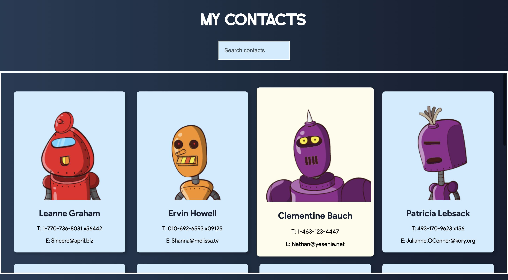

My Contacts App

This is a basic React App which displays a list of pre-defined contacts and allows the user to filter/search through those contacts.

Contacts are gathered from JSONPlaceholder using Fetch API and a 'Scroll' component has been added for stylistic purposes.

## Table of contents

- [Overview](#overview)
  - [Screenshots](#screenshots)
  - [Links](#links)
- [My process](#my-process)
  - [Built with](#built-with)
  - [What I learned](#what-i-learned)
  - [Continued development](#continued-development)
- [Author](#author)

## Overview

### Screenshots

### Links

- Live Site URL: (https://mcddcm.github.io/my-contacts-app/)

## My process

### Built with

- React.js
- Tachyons CSS properties

### Continued development

Future projects will focus on delivering larger React applications using React Hooks and Redux.

## Author

- Github - [@mcddcm](https://github.com/mcddcm)
